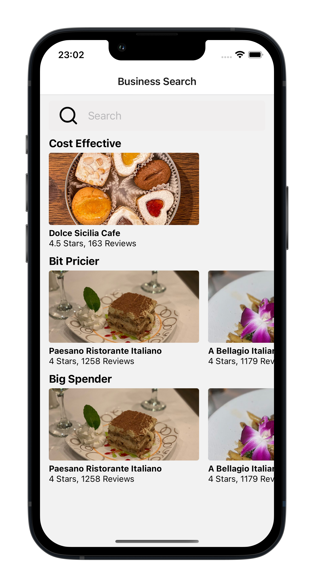
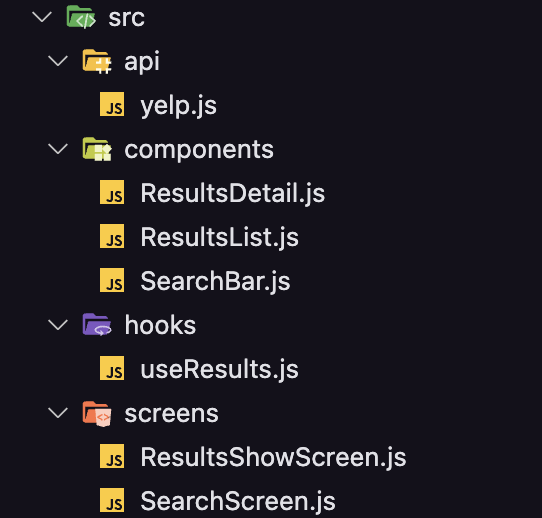

# food

Application created with Expo that displays a list of restaurants using the Axios library in the API request.

## Screenshots 📸



## Technologies 👨🏻‍💻

- [Expo](https://expo.dev/)
- [Axios](https://axios-http.com/ptbr/docs/intro)
- [React Native Reanimated](https://docs.swmansion.com/react-native-reanimated/)

## Architecture 📂



## Learned ✍️

- Best practices for making API requests with Axios;

## How to Install 🚀

```bash
git clone git@github.com:lucalves/food.git

cd food

npm install

expo start
```

## License 📝

MIT
